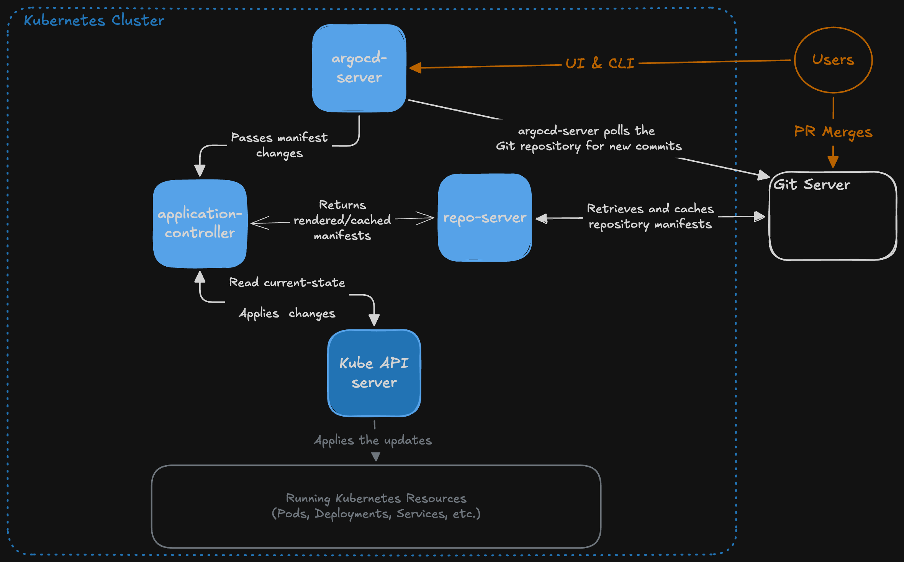

# Part-1---ArgoCD-Technical-Implementation
This repository is used to store all configuration files, manifests, and documentation needed to run and review the solution I created.


## Table of Contents

- [Argo CD Architecture & GitOps Flow](#argo-cd-architecture--gitops-flow)
- [Prerequisites](#prerequisites)
- [How to Deploy](#how-to-deploy)
  - [Create a Kubernetes cluster](#create-a-kubernetes-cluster)
  - [Deploy Argo CD & Reach the UI](#deploy-argo-cd--reach-the-ui)
  - [Manage Argo CD with Argo CD](#manage-argo-cd-with-argo-cd)
  - [Bootstrap the root app-of-apps application](#bootstrap-the-root-app-of-apps-application)
  - [Deploy Prometheus, metrics, dashboards, and alerts](#deploy-prometheus-metrics-dashboards-and-alerts)
  - [SSO Setup with Okta & OIDC](#sso-setup-with-okta--oidc)
  - [Manage multiple environments with an ApplicationSet](#manage-multiple-environments-with-an-applicationset)
- [Design Decisions & Trade-offs](#design-decisions--trade-offs)
- [Assumptions](#assumptions)


## Argo CD Architecture & GitOps Flow



When a change is committed to Git, the following sequence brings the cluster to the desired state:

1. User merges a pull request into the Git repository.
2. The Git Server stores the updated manifests.
3. The argocd-server polls the Git repository and detects the new commit.
4. The argocd-server notifies the application-controller of the manifest changes.
5. The application-controller requests the desired manifests from the repo-server.
6. The repo-server retrieves, renders, and caches the manifests before returning them to the application-controller.
7. The application-controller retrieves the current cluster state from the Kubernetes API Server.
8. The application-controller compares the desired state from Git with the live state in the cluster.
9. If auto-sync is enabled and the application is OutOfSync, the application-controller applies the rendered manifests through the Kubernetes API Server.
10. The Kubernetes API Server updates the running Kubernetes resources until they match the desired state.

If resources are modified directly in the cluster, the same reconciliation process detects the configuration drift. With `selfHeal` enabled, the application-controller automatically restores the cluster so that it matches the desired state stored in Git.

[Component responsibilities per Argo CD's Component Architecture documentation](argo-cd.readthedocs.io/en/stable/developer-guide/architecture/components/)

## Prerequisites

- [Docker](https://www.docker.com/get-started/) (v29.6.2)
- [Kubectl](https://kubernetes.io/docs/tasks/tools/#kubectl) (v1.36.1)
- [Kind](https://kind.sigs.k8s.io/docs/user/quick-start/#installing-from-release-binaries) (v0.32.0)
- [Helm](https://helm.sh/docs/intro/install/) (v4.2.3)

## How to Deploy


### Create a Kubernetes cluster

First, we must create a Kubernetes cluster in which Argo CD and our application will be deployed. In this assessment, we will use [kind](https://kind.sigs.k8s.io/docs/user/quick-start/#creating-a-cluster) to quickly deploy a cluster locally to our machine: `kind create cluster`.

This should take a minute or so to run and provision a simple single-node Kubernetes cluster that we can use.


### Deploy Argo CD & Reach the UI

To deploy Argo CD in a way where Argo CD manages itself, we first must take a few prerequisite steps.
1. Create a directory in our Git repo to host Argo CD's manifest files

```
mkdir -p argocd/install
```

2. Create the kustomization.yaml file with our targeted version (v3.4.5)

```
vim argocd/install/kustomization.yaml

---
apiVersion: kustomize.config.k8s.io/v1beta1
kind: Kustomization
namespace: argocd
resources:
  - github.com/argoproj/argo-cd//manifests/cluster-install?ref=v3.4.5
```

3. Now we deploy Argo CD using the kustomization file we created:

```
#Creates the argocd namespace:
kubectl create namespace argocd

#Applies argocd based on the kustomization file created in step 2:
kubectl apply -n argocd --server-side --force-conflicts -k argocd/install/
```

4. Confirm pods in the Argo CD namespace reach 'Running' status

```
kubectl get pods -n argocd

---
NAME                                                READY   STATUS    RESTARTS   AGE
argocd-application-controller-0                     1/1     Running   0          2m7s
argocd-applicationset-controller-7d4d7c7b89-ftqmc   1/1     Running   0          2m8s
argocd-dex-server-cbddb9676-spbnw                   1/1     Running   0          2m8s
argocd-notifications-controller-7b55c64b69-nbmzf    1/1     Running   0          2m8s
argocd-redis-68bc658cfb-grh2x                       1/1     Running   0          2m8s
argocd-repo-server-56c67cf674-mr86f                 1/1     Running   0          2m8s
argocd-server-66b7d96445-dgghw                      1/1     Running   0          2m7s
```

5. Access the Argo CD UI:

```
#Get UI password:
kubectl -n argocd get secret argocd-initial-admin-secret -o jsonpath="{.data.password}" | base64 -d

#use kubectl port-forward to quickly access the Argo CD UI
kubectl port-forward svc/argocd-server -n argocd 8080:443
```

6. If you're hosting on a local machine, the UI should now be accessible via `https://localhost:8080`. From here, you can accept the self-signed certificate warning and sign in using the username `admin` and the password we retrieved from the last step.

If you've done everything correctly. You should be logged into the Argo CD UI and see the applications page.


### Manage Argo CD with Argo CD

We want Argo CD to be "self-managed" so we need to make our Argo CD instance an Application. Using the template manifest below, create the application in a directory `apps/` in your Git repository.

```
apiVersion: argoproj.io/v1alpha1
kind: Application
metadata:
  name: argocd
  namespace: argocd
spec:
  project: default
  source:
    repoURL: <your-repoURL>
    path: argocd/install          # <-- points at the dir where kustomization.yaml lives
    targetRevision: main          # <-- our repo's branch, not the upstream stable tag
  destination:
    server: https://kubernetes.default.svc
    namespace: argocd
  syncPolicy:
    automated:
      prune: false            
      selfHeal: true
    syncOptions:
      - ServerSideApply=true

#Template from https://argo-cd.readthedocs.io/en/stable/operator-manual/declarative-setup/#server-side-apply-requirement
```
Save this to your git repository and then apply the manifest inside your cluster with something like `kubectl apply -f <file-name-here>`. We need to use `kubectl apply` at first because Argo CD can't manage an Application it doesn't know exists yet. Once the Argo CD appears as an application in the UI and you verify a simple test-sync works, feel free to go into your repo and change `prune:` to `true` for self-management.

>If you'd like to do a quick test to make sure that Argo CD reacts to changes in your Git repository, you can add a simple label section to your kustomize.yaml file. Commit the change and push it to your git repository. Re-sync the application and see if the change is propagated:
```
labels:
  - pairs:
      test-label: loop-check
    includeSelectors: false
```
>Once tested, you can remove this label block and continue with the next steps.

### Bootstrap the root app-of-apps application

Now that we've created an application that allows Argo CD to 'self-manage' itself, we can deploy a root app-of-apps application that will use the `apps` directory we created earlier which will host all the application manifests we plan on creating.


Create a bootstrapping directory in your Git repo and add the following `.yaml` file:

```
# bootstrap/root-app.yaml
apiVersion: argoproj.io/v1alpha1
kind: Application
metadata:
  name: root
  namespace: argocd
  finalizers:
    - resources-finalizer.argocd.argoproj.io      #Cascading delete: removing root also removes its child apps
spec:
  project: default
  source:
    repoURL: <your-repoURL>
    path: apps                 # <-- the folder full of Application manifests
    targetRevision: main
    directory:
      recurse: true            # picks up nested apps too, future-proofing
  destination:
    server: https://kubernetes.default.svc
    namespace: argocd          # where Application CRs live
  syncPolicy:
    automated:
      prune: false             # Like before, flip to 'true' once tested        
      selfHeal: true
    syncOptions:
      - ServerSideApply=true
```

Once this is created, we need to paradoxically manually deploy the root application using `kubectl apply -f bootstrap/<file-name>.yaml` to initialize the root app-of-apps application. With this deployed, the root application will now manage the `apps/` directory and deploy new applications when new manifests become available.


### Deploy Prometheus, metrics, dashboards, and alerts

1. Deploy Prometheus, Grafana, and Alertmanager via Helm

We're going to use Helm to deploy Prometheus into our clusters. It's simple and will deploy Alertmanager, Grafana, Prometheus, and the necessary operators. Let's first confirm the latest versions of prometheus that are available using Helm

```
helm repo add prometheus-community https://prometheus-community.github.io/helm-charts
helm repo update
helm search repo kube-prometheus-stack --versions | head
```

On the day of performing this test, these were the chart versions available:

```
NAME                                      	CHART VERSION	APP VERSION	DESCRIPTION                                       
prometheus-community/kube-prometheus-stack	87.18.0      	v0.92.1    	kube-prometheus-stack collects Kubernetes manif...
prometheus-community/kube-prometheus-stack	87.17.0      	v0.92.1    	kube-prometheus-stack collects Kubernetes manif...
prometheus-community/kube-prometheus-stack	87.16.1      	v0.92.1    	kube-prometheus-stack collects Kubernetes manif...
prometheus-community/kube-prometheus-stack	87.16.0      	v0.92.1    	kube-prometheus-stack collects Kubernetes manif...
prometheus-community/kube-prometheus-stack	87.15.2      	v0.92.1    	kube-prometheus-stack collects Kubernetes manif...
prometheus-community/kube-prometheus-stack	87.15.1      	v0.92.1    	kube-prometheus-stack collects Kubernetes manif...
prometheus-community/kube-prometheus-stack	87.15.0      	v0.92.1    	kube-prometheus-stack collects Kubernetes manif...
prometheus-community/kube-prometheus-stack	87.14.0      	v0.92.1    	kube-prometheus-stack collects Kubernetes manif...
prometheus-community/kube-prometheus-stack	87.13.0      	v0.92.1    	kube-prometheus-stack collects Kubernetes manif...
```

Using this information, we will deploy `v87.18.0` of the chart, which we will reference in the application manifest for Prometheus:

```
apiVersion: argoproj.io/v1alpha1
kind: Application
metadata:
  name: monitoring
  namespace: argocd
  finalizers:
    - resources-finalizer.argocd.argoproj.io
spec:
  project: default
  source:
    repoURL: https://prometheus-community.github.io/helm-charts
    chart: kube-prometheus-stack
    targetRevision: 87.18.0          # <-- pin the exact version from helm search
    helm:
      values: |
        # kind single-node: disable control-plane scrape targets that aren't reachable
        kubeControllerManager:
          enabled: false
        kubeScheduler:
          enabled: false
        kubeEtcd:
          enabled: false
        kubeProxy:
          enabled: false
        # Let Prometheus discover ServiceMonitors in ALL namespaces, not just its own
        prometheus:
          prometheusSpec:
            serviceMonitorSelectorNilUsesHelmValues: false. # Used so Prometheus can scrape any ServiceMonitor
            ruleSelectorNilUsesHelmValues: false
  destination:
    server: https://kubernetes.default.svc
    namespace: monitoring
  syncPolicy:
    automated:
      prune: true
      selfHeal: true
    syncOptions:
      - ServerSideApply=true        # REQUIRED — CRD annotation size limit
      - CreateNamespace=true        # makes the monitoring namespace for you if not already created
```

Create this file in the `apps/` directory of our Git repo and head over to the Argo CD UI to confirm that Prometheus is running under root.

2. Deploy ServiceMonitors for the argocd namespace resources

Next, we will want to deploy ServiceMonitors for the resources in the Argo CD namespace so metrics can be collected for them. We will create the manifest for these ServiceMonitors under the `argocd/install` directory:

```
apiVersion: monitoring.coreos.com/v1
kind: ServiceMonitor
metadata:
  name: argocd-metrics
  namespace: argocd
spec:
  selector:
    matchLabels:
      app.kubernetes.io/name: argocd-metrics
  endpoints:
    - port: metrics
---
apiVersion: monitoring.coreos.com/v1
kind: ServiceMonitor
metadata:
  name: argocd-server-metrics
  namespace: argocd
spec:
  selector:
    matchLabels:
      app.kubernetes.io/name: argocd-server-metrics
  endpoints:
    - port: metrics
---
apiVersion: monitoring.coreos.com/v1
kind: ServiceMonitor
metadata:
  name: argocd-repo-server-metrics
  namespace: argocd
spec:
  selector:
    matchLabels:
      app.kubernetes.io/name: argocd-repo-server
  endpoints:
    - port: metrics
---
apiVersion: monitoring.coreos.com/v1
kind: ServiceMonitor
metadata:
  name: argocd-applicationset-controller-metrics
  namespace: argocd
spec:
  selector:
    matchLabels:
      app.kubernetes.io/name: argocd-applicationset-controller
  endpoints:
    - port: metrics
---
apiVersion: monitoring.coreos.com/v1
kind: ServiceMonitor
metadata:
  name: argocd-dex-server
  namespace: argocd
spec:
  selector:
    matchLabels:
      app.kubernetes.io/name: argocd-dex-server
  endpoints:
    - port: metrics
---
apiVersion: monitoring.coreos.com/v1
kind: ServiceMonitor
metadata:
  name: argocd-notifications-controller
  namespace: argocd
spec:
  selector:
    matchLabels:
      app.kubernetes.io/name: argocd-notifications-controller-metrics
  endpoints:
    - port: metrics
```

We will then reference this new file in the kustomization.yaml manifest:

```
apiVersion: kustomize.config.k8s.io/v1beta1
kind: Kustomization
namespace: argocd
resources:
  - github.com/argoproj/argo-cd//manifests/cluster-install?ref=v3.4.5
  - <servicemonitors-file-name-here>.yaml      
```

Commit these changes to your Git repository and and synce your applications in the Argo CD UI. Once everything is synced, you can port-forward the prometheus endpoint and check the status of your Services and perform manual Queries such as `argocd_app_info`

```
kubectl -n monitoring port-forward svc/prometheus-operated 9090
```

You can then access Prometheus via `http://localhost:9090`

3. Deploy an Argo CD dashboard to Grafana via GitOps

With metrics flowing into Prometheus, we now want to visualize them in Grafana. Rather than importing a dashboard by hand through the Grafana UI (which wouldn't be captured in Git), we'll deploy it declaratively. The `kube-prometheus-stack` chart runs a sidecar container alongside Grafana that watches for ConfigMaps labeled `grafana_dashboard: "1"` and automatically loads any dashboard JSON they contain. We can confirm the sidecar is present with:

```
kubectl -n monitoring get deployment monitoring-grafana -o jsonpath='{.spec.template.spec.containers[*].name}{"\n"}'

---
grafana-sc-dashboard grafana-sc-datasources grafana
```

The `grafana-sc-dashboard` container is the sidecar we'll be feeding.

First, create a directory for our dashboards and pull down the official Argo CD dashboard JSON:

```
mkdir -p dashboards
curl -sL https://raw.githubusercontent.com/argoproj/argo-cd/master/examples/dashboard.json -o argocd-dashboard.json
```

Confirm the download is real JSON and not an error page — the output should begin with `{`:

```
head -c 200 argocd-dashboard.json; echo
```

Rather than hand-embed several hundred lines of JSON into a ConfigMap manifest (and risk an indentation mistake), we let `kubectl` generate the manifest for us. The `--dry-run=client -o yaml` flags mean nothing is applied to the cluster — the ConfigMap YAML is simply written to a file for Argo CD to manage:

```
kubectl create configmap argocd-grafana-dashboard \
  --from-file=argocd-dashboard.json \
  --namespace monitoring \
  --dry-run=client -o yaml > dashboards/argocd-dashboard-configmap.yaml
```

The generated file won't have the sidecar label yet, so we add it manually under `metadata`. The final `dashboards/argocd-dashboard-configmap.yaml` should look like this (JSON truncated for readability):

```
apiVersion: v1
kind: ConfigMap
metadata:
  name: argocd-grafana-dashboard
  namespace: monitoring
  labels:
    grafana_dashboard: "1"      # <-- the label the Grafana sidecar watches for
data:
  argocd-dashboard.json: |
    {
      "annotations": { ... },
      "panels": [ ... ],
      ...
    }
```

The `grafana_dashboard: "1"` label is the entire trigger — without it, the ConfigMap is inert; with it, the sidecar imports the dashboard into Grafana automatically.

4. Manage the dashboard through the root application

Because our `monitoring` application is a Helm chart (and has no path into our repo), we create a small dedicated application to manage the `dashboards/` directory. Create the following in the `apps/` directory so that root picks it up:

```
apiVersion: argoproj.io/v1alpha1
kind: Application
metadata:
  name: dashboards
  namespace: argocd
  finalizers:
    - resources-finalizer.argocd.argoproj.io
spec:
  project: default
  source:
    repoURL: <your-repoURL>
    path: dashboards           # <-- the directory holding our dashboard ConfigMap(s)
    targetRevision: main
  destination:
    server: https://kubernetes.default.svc
    namespace: monitoring      # ConfigMap must land where Grafana's sidecar is watching
  syncPolicy:
    automated:
      prune: true
      selfHeal: true
```

Commit both `dashboards/argocd-dashboard-configmap.yaml` and the new `apps/dashboards-app.yaml` to your Git repository. Root will detect the new application and sync it, applying the ConfigMap into the `monitoring` namespace, where the Grafana sidecar loads it.

To view the result, get the Grafana admin password and port-forward the Grafana service:

```
#Get Grafana admin password:
kubectl -n monitoring get secret monitoring-grafana -o jsonpath="{.data.admin-password}" | base64 -d; echo

#Port-forward the Grafana UI:
kubectl -n monitoring port-forward svc/monitoring-grafana 3000:80
```

Grafana is then accessible at `http://localhost:3000` with username `admin`. The Argo CD dashboard should appear under the dashboards list.

5. Configure alerts for Argo CD

With metrics flowing and a dashboard in place, the final piece is alerting. The `kube-prometheus-stack` deployment includes the Prometheus Operator, which watches for `PrometheusRule` resources and loads them into Prometheus automatically — the same pattern as the ServiceMonitors, but for alert rules instead of scrape targets. Because we set `ruleSelectorNilUsesHelmValues: false` in the monitoring application's values earlier, Prometheus will discover any `PrometheusRule` in the cluster regardless of its labels.

We'll define a set of alerts covering the three conditions most worth knowing about: an application stuck out of sync, an application that has become unhealthy, and an Argo CD component going down. Create the following as `alerts.yaml` in the `argocd/install` directory, alongside the ServiceMonitors:

```
apiVersion: monitoring.coreos.com/v1
kind: PrometheusRule
metadata:
  name: argocd-alerts
  namespace: argocd
spec:
  groups:
    - name: argocd.rules
      rules:
        - alert: ArgoCDAppOutOfSync
          expr: argocd_app_info{sync_status="OutOfSync"} == 1
          for: 30m
          labels:
            severity: warning
          annotations:
            summary: "Argo CD application {{ $labels.name }} is OutOfSync"
            description: "Application {{ $labels.name }} has been OutOfSync for more than 30 minutes."

        - alert: ArgoCDAppUnhealthy
          expr: argocd_app_info{health_status=~"Degraded|Missing"} == 1
          for: 15m
          labels:
            severity: critical
          annotations:
            summary: "Argo CD application {{ $labels.name }} is {{ $labels.health_status }}"
            description: "Application {{ $labels.name }} has been {{ $labels.health_status }} for more than 15 minutes."

        - alert: ArgoCDComponentDown
          expr: up{namespace="argocd"} == 0
          for: 10m
          labels:
            severity: critical
          annotations:
            summary: "Argo CD component {{ $labels.job }} is down"
            description: "The Argo CD component {{ $labels.job }} has been unreachable for more than 10 minutes."
```

A few notes on the rules:

- The `for:` durations prevent false alarms. An application is briefly `OutOfSync` during every normal sync, so we only alert once it has stayed that way past the window.
- `ArgoCDComponentDown` uses the `up` metric that Prometheus generates for every scrape target, so a single rule covers all Argo CD components. 

As with the ServiceMonitors, we reference the new file in `argocd/install/kustomization.yaml` so it becomes part of the self-managed Argo CD application:

```
apiVersion: kustomize.config.k8s.io/v1beta1
kind: Kustomization
namespace: argocd
resources:
  - github.com/argoproj/argo-cd//manifests/cluster-install?ref=v3.4.5
  - servicemonitors.yaml
  - alerts.yaml
```

Commit both files and let the `argocd` application sync. We can confirm the rule was applied to the cluster and picked up by Prometheus:

```
kubectl -n argocd get prometheusrule

---
NAME            AGE
argocd-alerts   30s
```

The alerts then appear in the Prometheus UI under the **Alerts** tab (`http://localhost:9090` after port-forwarding), sitting inactive until one of their conditions is met. To verify an alert fires, we can make an application drift out of sync — for example, by committing a change that isn't synced — and watch the `ArgoCDAppOutOfSync` alert move from Inactive to Pending to Firing once the `for:` window elapses.

### SSO Setup with Okta & OIDC

We will be using Okta as our IdP for this project using a free Okta Developer account and following the following documentation:

- [Argo CD & Okta OIDC (without Dex)](https://argo-cd.readthedocs.io/en/stable/operator-manual/user-management/okta/#oidc-without-dex)
- [Sensitive Data and SSO Client Secrets](https://argo-cd.readthedocs.io/en/stable/operator-manual/user-management/#sensitive-data-and-sso-client-secrets)

Most of the first link revolves around configuring things on the Okta side as well as the Argo CD UI. After that, we'll create a Kubernetes secret to hold the SSO `clientSecret` which we will then pass into the Okta configmap we create.

#### Storing the client secret internally in the cluster

The OIDC client secret is sensitive and must **not** be committed to Git. Rather than place it in a manifest, we inject it directly into the existing `argocd-secret` and reference it from config. Using `stringData` lets us pass the raw secret. Kubernetes base64-encodes it for us — and `--type merge` adds our key without disturbing the other keys already in `argocd-secret` (the server signing key, admin password hash, and TLS material):

```
kubectl -n argocd patch secret argocd-secret \
  --type merge \
  -p '{"stringData": {"oidc.okta.clientSecret": "<your-okta-client-secret>"}}'
```

The config then references this key with `$oidc.okta.clientSecret` rather than embedding the value, keeping the secret out of the repo entirely.

#### Persisting the configuration in Git

Once everything is configured on the Okta end and you can successfully log in with Okta on the Argo CD UI, we need to make sure this persists. As it currently stands from the documentation, we used `kubectl edit` to make changes to the `argocd-cm` and `argocd-rbac-cm` ConfigMaps — but this is imperative and temporary. Because our Argo CD Application manages itself with `selfHeal: true`, it will eventually notice the live ConfigMaps differ from what's in Git and **revert them to the upstream defaults**, silently breaking SSO. For the configuration to be the source of truth, it has to live in the repository.

The wrinkle is that `argocd-cm` and `argocd-rbac-cm` already exist in the upstream `cluster-install` manifests our kustomization pulls in. We can't simply add new copies — that would create a conflict. Instead, we use **kustomize patches** that merge our keys into the existing ConfigMaps.

Create two patch files in `argocd/install/`:

```
# argocd/install/argocd-cm-patch.yaml
apiVersion: v1
kind: ConfigMap
metadata:
  name: argocd-cm
data:
  url: https://localhost:8080
  oidc.config: |
    name: Okta
    issuer: <your-issuer-URI>
    clientID: <your-client-id>
    clientSecret: $oidc.okta.clientSecret
    requestedScopes: ["openid", "profile", "email"]
```

```
# argocd/install/argocd-rbac-cm-patch.yaml
apiVersion: v1
kind: ConfigMap
metadata:
  name: argocd-rbac-cm
data:
  policy.csv: |
    g, <your-okta-email>, role:admin
  scopes: '[email]'
```

Then reference them in `argocd/install/kustomization.yaml` via a `patches:` block:

```
apiVersion: kustomize.config.k8s.io/v1beta1
kind: Kustomization
namespace: argocd
resources:
  - github.com/argoproj/argo-cd//manifests/cluster-install?ref=v3.4.5
  - servicemonitors.yaml
  - prometheus-rules.yaml
patches:
  - path: argocd-cm-patch.yaml
  - path: argocd-rbac-cm-patch.yaml
```

Kustomize matches a patch to a base resource by kind + name + namespace, so naming the patches after the existing ConfigMaps causes our keys to be **merged in** rather than replacing them,the upstream keys stay intact, and our SSO config is layered on top.

Before committing, render the result locally to confirm the merge worked and that the secret appears only as a `$`-reference, never as its literal value:

```
kubectl kustomize argocd/install/ | grep -E "oidc.config|url: https|policy.csv"
```

Once this looks correct, commit and push. The self-managed `argocd` Application syncs the change; because the rendered state matches what was already applied imperatively, it's a no-op merge and your session is unaffected. From this point on, `selfHeal` **protects** the SSO configuration instead of threatening it.

#### Pitfalls to watch for

A few issues I ran into that are worth flagging:

- **Redirect URI mismatch.** Okta pre-fills a default sign-in redirect URI of `/authorization-code/callback`, but when I configured Argo CD I used `/auth/callback`. These must match exactly or Okta returns a `400 invalid_request`. Set the Okta app's Sign-in redirect URI to `https://localhost:8080/auth/callback` or add the correct original URI via Okta Admin Console.
- **User not assigned to the application.** If you skip group/user assignment when creating the Okta app, login fails with `access_denied` ("User is not assigned to the client application"). Assign your user (or the built-in `Everyone` group) under the app's **Assignments** tab.
- **Namespace in the patch metadata.** The upstream `argocd-cm` has no `namespace:` field, and kustomize matches patches on namespace among other fields. Including `namespace: argocd` in the patch metadata causes a "no matches for patch" error. Omit it and let the top-level `namespace:` in the kustomization apply it at build time.
- **Every `argocd.example.com` in the docs → `https://localhost:8080`.** Since we access Argo CD via `kubectl port-forward`, the redirect URI, sign-out URI, `url:` field, and the authorization server's Audience all need to use the localhost address, not the doc's placeholder domain.

### Manage multiple environments with an ApplicationSet

The final piece is deploying a single application across multiple environments without hand-writing an Application manifest for each one. For this we use an **ApplicationSet**. Instead of one file per environment, we define one template plus a *generator* that stamps out an Application per environment automatically.

We'll deploy the Argo CD `guestbook` example across `dev`, `staging`, and `prod` which is used throughout Argo CD's documentation and examples. Each environment will differ by replica count to demonstrate per-environment configuration.

First, create an `environments/` directory with one subdirectory per environment. Each holds a Kustomization that pulls the upstream guestbook base and overrides the replica count.

```
# environments/dev/kustomization.yaml
apiVersion: kustomize.config.k8s.io/v1beta1
kind: Kustomization
resources:
  - https://github.com/argoproj/argocd-example-apps//kustomize-guestbook
replicas:
  - name: guestbook-ui
    count: 1
```

Repeat for `staging` (`count: 2`) and `prod` (`count: 3`), giving the repo:

```
environments/
├── dev/     (1 replica)
├── staging/ (2 replicas)
└── prod/    (3 replicas)
```

Next, create the ApplicationSet in the `apps/` directory so that our root app-of-apps manages it:

```
# apps/guestbook-appset.yaml
apiVersion: argoproj.io/v1alpha1
kind: ApplicationSet
metadata:
  name: guestbook
  namespace: argocd
spec:
  goTemplate: true
  goTemplateOptions: ["missingkey=error"]
  generators:
    - git:
        repoURL: <your-repoURL>
        revision: main
        directories:
          - path: environments/*        # discovers one directory per environment
  template:
    metadata:
      name: 'guestbook-{{.path.basename}}'     # -> guestbook-dev, guestbook-staging, guestbook-prod
    spec:
      project: default
      source:
        repoURL: <your-repoURL>
        targetRevision: main
        path: '{{.path.path}}'                 # -> environments/dev, etc.
      destination:
        server: https://kubernetes.default.svc
        namespace: 'guestbook-{{.path.basename}}'
      syncPolicy:
        automated:
          prune: false
          selfHeal: true
        syncOptions:
          - CreateNamespace=true               # each environment gets its own namespace
```

The **Git directory generator** scans `environments/*`, and for each matching directory produces a set of template variables: `{{.path.basename}}` (the directory name, e.g. `dev`) and `{{.path.path}}` (the full path, e.g. `environments/dev`). The template uses these to generate one Application per environment — named `guestbook-<env>`, sourcing from that environment's folder, deploying into its own `guestbook-<env>` namespace. `goTemplateOptions: ["missingkey=error"]` makes template errors fail loudly rather than silently producing a broken Application.

Commit `environments/` and `apps/guestbook-appset.yaml`, then push. Root detects the new ApplicationSet and syncs it; the ApplicationSet controller then generates the three Applications automatically:

```
kubectl -n argocd get applicationset guestbook
kubectl get applications -A | grep guestbook

---
argocd   guestbook-dev       Synced   Healthy
argocd   guestbook-prod      Synced   Healthy
argocd   guestbook-staging   Synced   Healthy
```

The per-environment replica differences confirm that the same application is deployed with different configuration in each environment:

```
kubectl get deploy -n guestbook-dev        # 1 replica
kubectl get deploy -n guestbook-staging    # 2 replicas
kubectl get deploy -n guestbook-prod       # 3 replicas
```

The payoff of this pattern is that we can quickly add a fourth environment if requested. We would simply create `environments/qa/kustomization.yaml` and push to our Git Repository. From there, the ApplicationSet discovers the new directory and generates `guestbook-qa` automatically, with no new Application manifest required.


## Design Decisions & Trade-offs
- Using kind to create the Kubernetes cluster
    - kind gives a reproducible local cluster ideal for evaluation and simple testing; a production deployment would likely target a managed cluster (EKS/GKE/AKS) or OpenShift for HA, real networking, and multi-node scale.
- Pinned Argo CD to a specific version (v3.4.5) rather than tracking `stable`
    - `stable` is a floating tag that moves as new releases land, which makes the desired state non-deterministic. Argo CD could reconcile itself toward a version I never chose or tested. Pinning a specific version in Git as the source of truth makes the install reproducible and upgrades an auditable, reviewable commit. The trade-off is that I don't automatically get new releases, which mirrors real organizational practice.
- Using kubectl port-forward, I'm able to easily access the Argo CD UI
    - This is a quick way to gain access but is only an option as long as the port-forward tunnel is open. In production environments, exposing Argo CD via something like an Ingress with proper DNS and TLS configured would be best practice.
- `prune` value set to `false` during bootstrapping of Argo CD instead of set to `true` like most documentation
    - Out of an abundance of caution, `prune` was set to `false` initially. For self-referential apps (Argo CD managing itself, the root app-of-apps), a misconfigured sync with pruning enabled could delete the very components doing the syncing, with nothing left to recover.
- Using an app-of-apps pattern and creating each manifest in the `/apps` directory in the repository.
    - app-of-apps is the foundational pattern (explicit, one-file-per-app); ApplicationSet is the scale-up (templated, generator-driven) that the [docs](https://argo-cd.readthedocs.io/en/stable/operator-manual/cluster-bootstrapping/#application-sets-and-cluster-labels-recommended) now recommend for bootstrapping.
    - The trade-off is that each app is an explicit file to maintain; at larger scale an ApplicationSet's templating would reduce that boilerplate
- I kept alerts for Dex despite it being down to prove that the alerts were actually working.
    - In a real environment, this would cause alert fatigue and would most likely be resolved by excluding dex from the Prometheus rules.
- Handled the OIDC client secret internally in the cluster rather than committing it.
    - The secret is injected into `argocd-secret` via `kubectl` and referenced from config with `$oidc.okta.clientSecret`, so it never enters Git. This method was used instead of creating an external secret-store/vault, which is probably more of a production-level method.
- Applied SSO config via Kustomize patches that merge into the upstream ConfigMaps.
    - `argocd-cm` and `argocd-rbac-cm` already exist in the upstream install, so rather than replace them, I patch them, merging the OIDC/RBAC keys in.
    - When creating the patches in the kustomize.yaml file, I specified namespaces but this created an error when testing.
- I used the `path` generator for the ApplicationSet, not multiple clusters for simplicity and lack of resources on my side to host multiple clusters. 


## Assumptions

Where the assignment left room for interpretation, I made the following assumptions:

- **"Multiple environments or clusters" was interpreted as multiple environments.** On a single local cluster, deploying one application across `dev`, `staging`, and `prod` (via Kustomize overlays generated by an ApplicationSet) demonstrates the pattern without the overhead of provisioning and registering additional clusters. The same ApplicationSet approach extends to multiple clusters with a cluster generator if needed.
- **A local `kind` cluster is acceptable for evaluation.** A production deployment would target a managed cluster (EKS/GKE/AKS) for HA, real networking, and multi-node scale, but `kind` provides a reproducible, self-contained environment for review.
- **A free-tier IdP is acceptable for SSO.** I used a free Okta Integrator (developer) account rather than a production identity provider, which is sufficient to demonstrate a working OIDC integration.
- **Ephemeral storage is acceptable.** No persistence requirement was specified, so Prometheus and Grafana use default (non-persistent) storage; metrics and dashboards reset if their pods restart. Production would use persistent volumes.
- **`kubectl port-forward` is an acceptable way to access the Argo CD and Grafana UIs.** No Ingress/DNS/TLS requirement was stated. A production setup would expose these via an Ingress with proper DNS and TLS.
- **Single-user, email-based RBAC is sufficient.** As a solo evaluation, the SSO identity is mapped directly to `role:admin` by email rather than through group-based RBAC.
- **The reviewer has the listed prerequisites installed** (Docker, kubectl, kind, Helm at the noted versions) and access to clone the repository.
